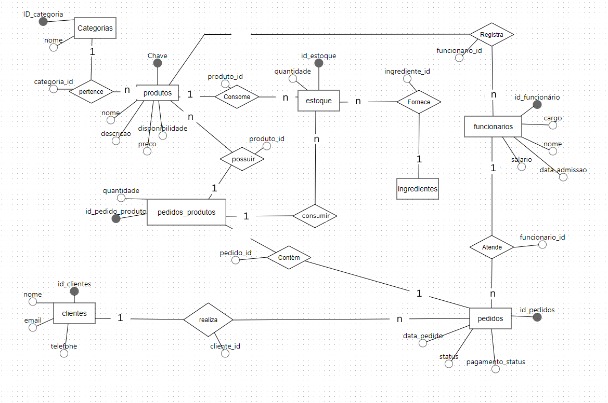
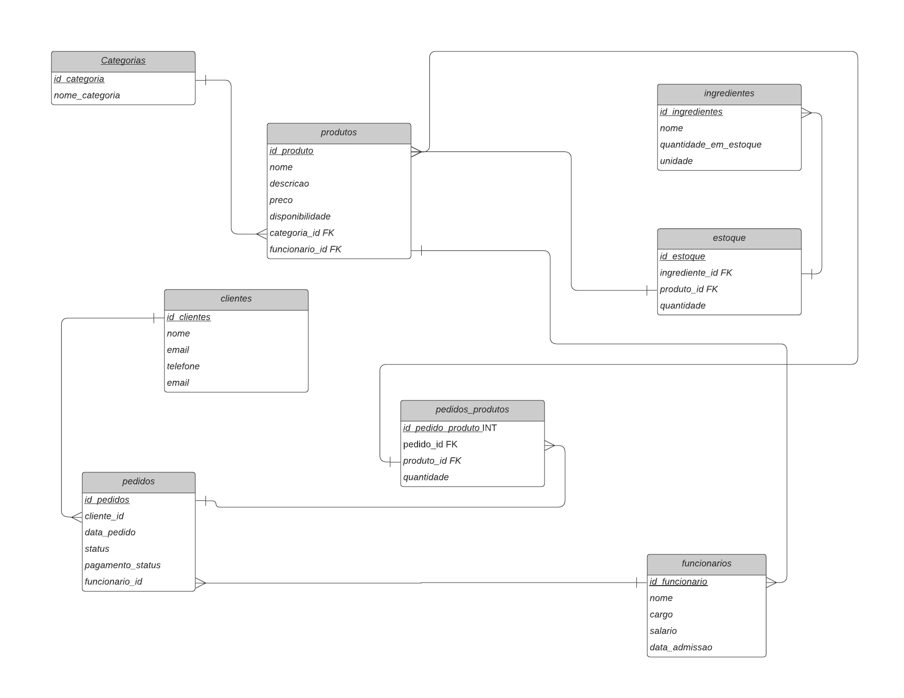
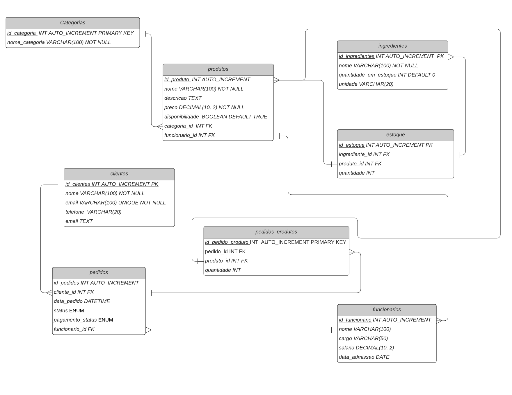

# Projeto Final de Banco de Dados - Lanchonete Vegana
Este projeto visa o desenvolvimento de um sistema de banco de dados robusto e eficiente para a gestão de uma lanchonete vegana, utilizando MySQL como sistema de gerenciamento de banco de dados (SGBD). A proposta abrange o ciclo completo de criação, implementação, e documentação do banco de dados, incluindo o design de diagramas, scripts para criação e manipulação de dados, e a estruturação de consultas otimizadas para atender às necessidades operacionais do negócio.

## Objetivo do Projeto
O objetivo principal deste projeto é projetar e implementar um banco de dados que suporte as operações diárias de uma lanchonete vegana. Este banco de dados abrange as áreas críticas do negócio, como gerenciamento de produtos, controle de estoque, registro e processamento de pedidos, cadastro de clientes, e gerenciamento de funcionários. O sistema visa promover a organização e eficiência, permitindo a automação de processos operacionais e a obtenção de informações essenciais de forma rápida e precisa.

# Modelo conceitual 

  

# modelo logico

  

# Modelo fisico

  

## Escopo e Funcionalidades
O banco de dados desenvolvido incluirá as seguintes funcionalidades:

- Cadastro e gerenciamento de produtos: Informações detalhadas sobre os itens no cardápio, incluindo ingredientes, preço e disponibilidade.
- Controle de estoque: Acompanhamento do estoque de ingredientes e produtos acabados, permitindo a atualização automática conforme novos pedidos são realizados.
- Gestão de pedidos: Registro completo dos pedidos realizados pelos clientes, desde a escolha dos produtos até a entrega, com informações sobre status e pagamento.
- Cadastro de clientes: Informações dos clientes, incluindo histórico de pedidos e preferências alimentares.
- Gestão de funcionários: Controle de dados sobre os funcionários da lanchonete, com funções específicas para organização do trabalho e gestão de salários.
- Relatórios e Análises: Geração de relatórios sobre vendas, desempenho de produtos e análise de estoque, para auxiliar na tomada de decisões.
## Tecnologias Utilizadas
MySQL: Para a criação do banco de dados, realizando a estruturação das tabelas, relações e consultas.
Diagrama de Entidade-Relacionamento (ER): Para visualização das entidades e suas relações no banco de dados.
